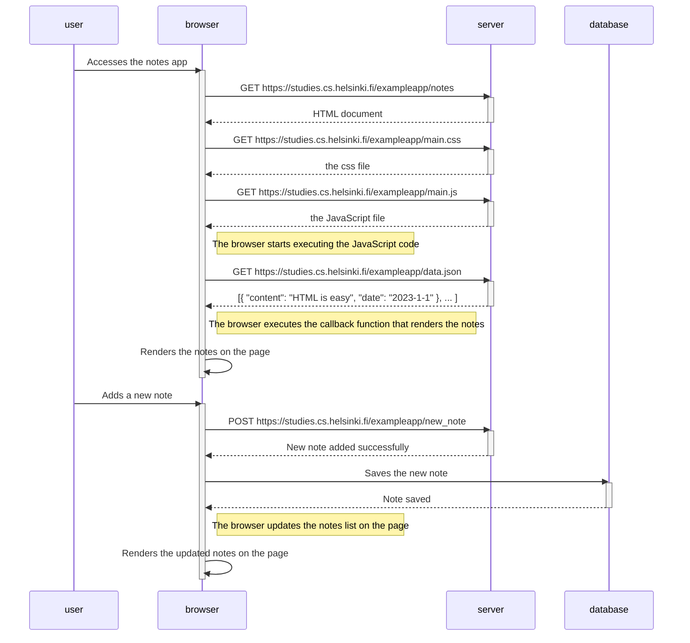

```mermaid
sequenceDiagram
    participant user
    participant browser
    participant server
    participant database

    user->>browser: Accesses the notes app
    activate browser
    browser->>server: GET https://studies.cs.helsinki.fi/exampleapp/notes
    activate server
    server-->>browser: HTML document
    deactivate server
    browser->>server: GET https://studies.cs.helsinki.fi/exampleapp/main.css
    activate server
    server-->>browser: the css file
    deactivate server
    browser->>server: GET https://studies.cs.helsinki.fi/exampleapp/main.js
    activate server
    server-->>browser: the JavaScript file
    deactivate server
    Note right of browser: The browser starts executing the JavaScript code
    browser->>server: GET https://studies.cs.helsinki.fi/exampleapp/data.json
    activate server
    server-->>browser: [{ "content": "HTML is easy", "date": "2023-1-1" }, ... ]
    deactivate server
    Note right of browser: The browser executes the callback function that renders the notes
    browser->>browser: Renders the notes on the page
    deactivate browser
    user->>browser: Adds a new note
    activate browser
    browser->>server: POST https://studies.cs.helsinki.fi/exampleapp/new_note
    activate server
    server-->>browser: New note added successfully
    deactivate server
    browser->>database: Saves the new note
    activate database
    database-->>browser: Note saved
    deactivate database
    Note right of browser: The browser updates the notes list on the page
    browser->>browser: Renders the updated notes on the page
    deactivate browser
```
    